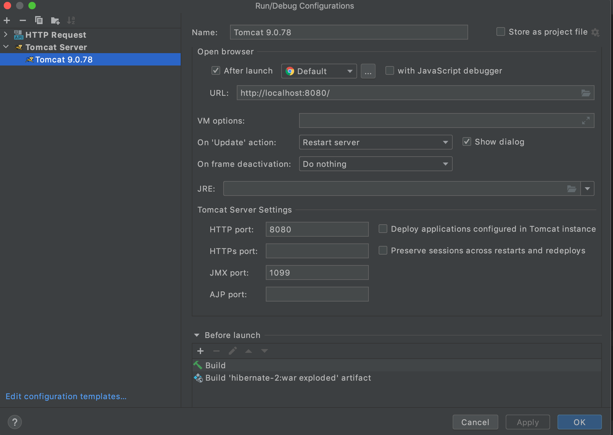

# Project: Hibernate II

Learning project with Hibernate.

Application is a managing of film renting stores.

- Initialize project with Maven, Spring, Hibernate
- Add MySQL DB
- Import DB dump (https://javarush.com/downloads/ide/javarush/dump-hibernate-2.sql)
- Create Entities for an existing DB

- Create Hibernate Session Factory Configuration
- Adding Repository with methods connected to Entity
- Create controller endpoints with DTO and calling services

# Technical stack

- Java 18
- Tomcat 9

Additional dependency and library used in application

- Maven
- Spring
- Jakarta
- Jackson
- Mysql
- Hibernate

#  Configuration

To run application, please setup Tomcat with your IDE.
Here an example configuration with IntelliJ IDEA 

